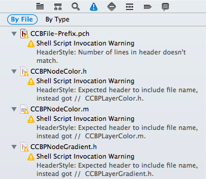

Obcd
====

[](https://travis-ci.org/dblock/obcd)

Deal with obsessive compulsive issues of programmers in Objective-C.

Eventually, the goal of OBCD is to become to Objective-C what [Rubocop](https://github.com/bbatsov/rubocop) is to Ruby. So far it does one useful thing: help you fix the comment style on top of .h and .m files. For example, it can tell you that the name of the file in that comment doesn't match the actual file name.

## Checks

* [HeaderStyle](docs/checks/HeaderStyle.md): Check header style on top of .h, .m and .pch files.

## Usage

```
gem install obcd
```

#### Get Help

```
obcd help
```

#### Example: Find Files with Invalid Headers

```
$ obcd --path=spec/fixtures find HeaderStyle

HeaderStyle/WrongExtension.m: 1 violation
/Users/artsy/HeaderStyle/WrongExtension.m:2:1: warning: HeaderStyle: Filename extension doesn't match, expected .m, got .h.

HeaderStyle/WrongFilename.h: 1 violation
/Users/artsy/HeaderStyle/WrongExtension.h:2:1: warning: HeaderStyle: Expected header to include file name, instead got //  ThisFilenameIsWrong.h.

Found 2 violations.
```

#### Xcode

You can also run OBCD as an Xcode build phase in order to see warnings inline in your files.

1. Add a new Run Script Build Phase
2. Add something like:

    ```
    source ~/.zshrc # or `source ~/.bashrc`
    obcd find HeaderStyle
    ```

The next time you build your project you should see any OBCD warnings alongside others:



## Contributing

See [CONTRIBUTING](CONTRIBUTING.md).

## Copyright and License

Copyright (c) 2014, Daniel Doubrovkine, [Artsy](http://artsy.github.io).

This project is licensed under the [MIT License](LICENSE.md).
